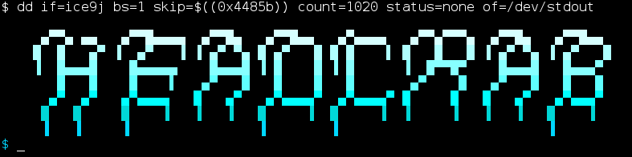
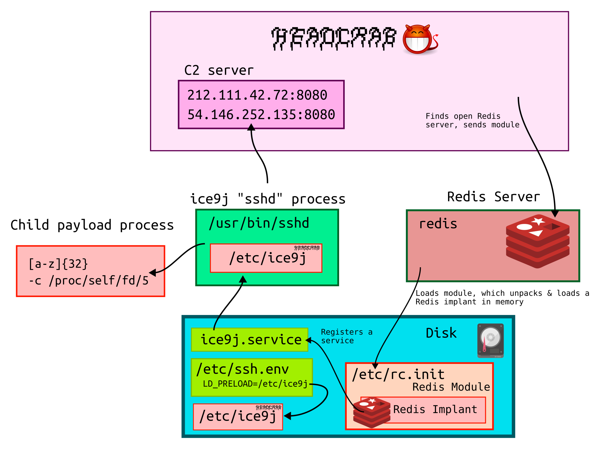
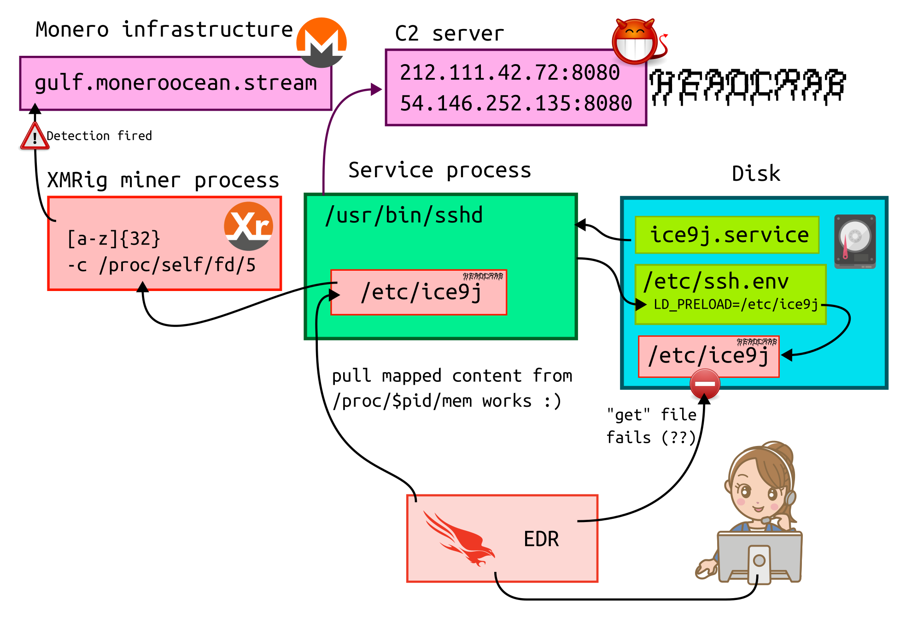
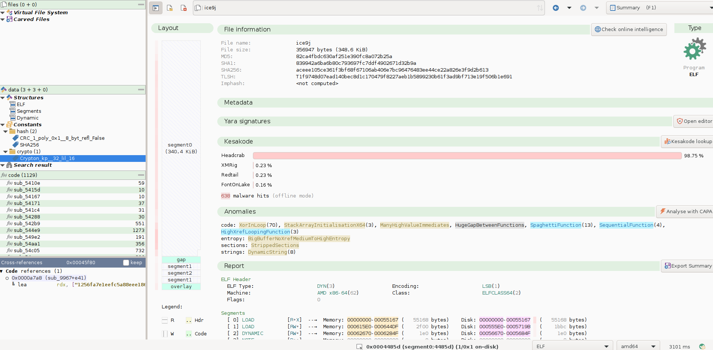

* HeadCrab malware identification & extraction
  * 1 - Identify the miners
  * 2 - Are there other /proc/self/fd/ processes ?
  * 3 - What it the common parent to these malicious processes ?
  * 4 - Reassembling malware from memory dumps
  * 5 - There is an associated service : ice9j.service
  * 6 - Digressions on the capabilities of this malware
    * 6.1 Targeted processes 
    * 6.2 Process creation capabilities
    * 6.3 Persistence mechanisms
    * 6.4 Backdoor capabilities
    * 6.5 Security features detection
    * 6.6 Pulling the configuration out
    * 6.7 Prying the configuration out
  * 7 - The Redis component
  * 8 - Forensics artifacts left by SELinux policies infractions for sshd calling SYSCALL=301/fanotify_mark
  * Conclusion
* IOC


# HeadCrab malware identification & extraction



```
$ dd if=ice9j bs=1 skip=$((0x4485b)) count=1020 status=none of=/dev/stdout

     ▄▀▀▄ ▄▄   ▄▀▀█▄▄▄▄  ▄▀▀█▄   ▄▀▀█▄▄   ▄▀▄▄▄▄   ▄▀▀▄▀▀▀▄  ▄▀▀█▄   ▄▀▀█▄▄  
    █  █   ▄▀ ▐  ▄▀   ▐ ▐ ▄▀ ▀▄ █ ▄▀   █ █ █    ▌ █   █   █ ▐ ▄▀ ▀▄ ▐ ▄▀   █ 
    ▐  █▄▄▄█    █▄▄▄▄▄    █▄▄▄█ ▐ █    █ ▐ █      ▐  █▀▀█▀    █▄▄▄█   █▄▄▄▀  
       █   █    █    ▌   ▄▀   █   █    █   █       ▄▀    █   ▄▀   █   █   █  
      ▄▀  ▄▀   ▄▀▄▄▄▄   █   ▄▀   ▄▀▄▄▄▄▀  ▄▀▄▄▄▄▀ █     █   █   ▄▀   ▄▀▄▄▄▀  
     █   █     █    ▐   ▐   ▐   █     ▐  █     ▐  ▐     ▐   ▐   ▐   █    ▐   
     ▐   ▐     ▐                ▐        ▐                          ▐        
```

This blog post describes a CGI SOC's malware identification process, as well as techniques to
grab the file sample from memory when normal remote file acquisition through an EDR fails.
Additionally, we extracted some easy-to-read content from the malicious sample we
obtained, as the malware capabilities already have been documented by other
security researchers in the past. In our case, we were not able to find evidence
that this compromise had a Redis entry point, but Redis was present in the scope.

The event that started this research was somewhere, DNS queries towards `gulf.moneroocean.stream` triggered a detection
rule because servers are not supposed to mine cryptocurrencies. We quickly
identified this was the HeadCrab malware backdoor planting cryptocurrency
miners. HeadCrab was already documented by AquaSec in 2023 ( links below ), and
a random sample was leaked on GitHub earlier this year.

* https://www.aquasec.com/blog/headcrab-attacks-servers-worldwide-with-novel-state-of-art-redis-malware/
* https://i.blackhat.com/EU-23/Presentations/EU-23-Eitani-REDIScoveringHeadCrabATechnicalAnalysisOfANovelMalware.pdf
* https://github.com/ice9j/headcrab


Nevertheless, we still had a go at documenting some properties of the malware, presenting
a way to setup a minimal debugging environment through Docker, writing a minimal configuration
extractor and present a forensic artifact we ignored until then : `setroubleshoot_database.xml`.

Finally, we are sharing IOC from this compromise that happened around 2025-10.


Overview of the infection :



## 1 - Identify the miners

Using CrowdStrike Falcon telemetry data, we searched for processes querying that domain:

    #event_simpleName=/DnsRequest/ DomainName=gulf.moneroocean.stream | groupBy([DomainName],function=[collect([#event_simpleName,ContextProcessId,ComputerName,aid,cid])])

This found hosts generating both `SuspiciousDnsRequest` and `DnsRequest` events. Having found them, we used `join` to find the kind of activity they generated:

    ComputerName=/(REDACTED-A|REDACTED-B)/F  | join({ComputerName=/(REDACTED-A|REDACTED-B)/F #event_simpleName=/DnsRequest/ DomainName=gulf.moneroocean.stream},field=ContextProcessId) | groupBy([#event_simpleName])


    "#event_simpleName"                  , "_count"
    "CriticalEnvironmentVariableChanged" , "2"
    "DnsRequest"                         , "1339"
    "NetworkConnectIP4"                  , "2032"
    "NetworkReceiveAcceptIP4"            , "6573"
    "SuspiciousDnsRequest"               , "710"
    "TlsClientHello"                     , "13"

This is aligned with a cryptocurrency miner. We then needed to find their command line, binaries, and nature. In CrowdStrike Falcon telemetry data, activity generated by the process will have its ProcessId under `ContextProcessId`, but process creation has the new ProcessId under `TargetProcessId`, hence the need for different `field=` and `key=` values.


    ComputerName=/(REDACTED-A|REDACTED-B)/F
    | join({ComputerName=/(REDACTED-A|REDACTED-B)/F #event_simpleName=/DnsRequest/ DomainName=gulf.moneroocean.stream},field=TargetProcessId,key=ContextProcessId)
    | groupBy([TargetProcessId],function=[collect([ImageFileName,FilePath,CommandLine,#event_simpleName,ParentProcessId,UID,ComputerName,SHA256HashData])])


This outputs :
* `FilePath` is `/memfd:/`, pretty problematic
* `CommandLine` is `[kswapd0]` or `hh32lettersredactedlgb -c /proc/self/fd/5`
* A `SHA256HashData` is e8532ac23828575c0a0a69443b54d1408e86f15361704215bd6fea1db306ee0a , a generic XMRig miner image documented in https://www.intezer.com/blog/cloud-security/rocke-group-actively-targeting-the-cloud-wants-your-ssh-keys/ notably.

This is interesting, since it seems this malware is able to spawn child
processes without tying them to a flat binary on disk, sometimes.

## 2 - Are there other /proc/self/fd/ processes ?

We just had to search on command lines :

    #event_simpleName=/ProcessRollup/F CommandLine=/-c \/proc\/self\/fd/ | table([@timestamp,ComputerName,UserName,ParentProcessId,TargetProcessId,RawProcessId,ImageFileName,CommandLine])

And found 8 processes, approximately one every other day, with the same 32
letters prefix followed by `-c /proc/self/fd/5`. They all shared the same parent, and all are e8532ac23828575c0a0a69443b54d1408e86f15361704215bd6fea1db306ee0a miners.

## 3 - What it the common parent to these malicious processes ?

Searching in our telemetry data for that specific Process ID, we found some `SyntheticProcessRollup2` events reporting a long-standing `/usr/sbin/sshd` process using the query below.

    #event_simpleName=/ProcessRollup/F TargetProcessId=1765324218157870966 | groupBy([TargetProcessId],function=[collect([ImageFileName,CommandLine,ComputerName,RawProcessId])])


Strange, since no authentications were found near the evil processes start events. Is this process really SSH?

First, check the kind of telemetry events created by it:


    ContextProcessId=1765324218157870966 ComputerName=REDACTED-B | groupBy([#event_simpleName],function=[collect([RemoteIP,RemotePort,SignalNumber])])


* Some `NetworkConnectIP4` to `212.111.42.72` and `54.146.252.135` on port `8080`
* A handful of `ProcessSignal` number 15 ( SIGKILL ) to child processes.

That's definitely aligned with this being a backdoor malware agent. Is there an
extra library loaded by this SSHD agent? Let's check that out with `cat /proc/pid/maps` :


    55b5ba893000-55b5ba89f000 r--p 00000000 08:03 295446                     /usr/sbin/sshd
    55b5ba89f000-55b5ba92e000 r-xp 0000c000 08:03 295446                     /usr/sbin/sshd
    55b5ba92e000-55b5ba979000 r--p 0009b000 08:03 295446                     /usr/sbin/sshd
    55b5ba979000-55b5ba97d000 r--p 000e5000 08:03 295446                     /usr/sbin/sshd
    55b5ba97d000-55b5ba97e000 rw-p 000e9000 08:03 295446                     /usr/sbin/sshd
    55b5ba97e000-55b5ba982000 rw-p 00000000 00:00 0 
    55b5bb951000-55b5bb972000 rw-p 00000000 00:00 0                          [heap]
    55b5bb972000-55b5bbcbb000 rw-p 00000000 00:00 0                          [heap]
    7fc597847000-7fc597848000 ---p 00000000 00:00 0 
    7fc597848000-7fc597888000 rw-p 00000000 00:00 0 
    7fc597888000-7fc597889000 ---p 00000000 00:00 0 
    7fc597889000-7fc5978c9000 rw-p 00000000 00:00 0 
    7fc5978c9000-7fc5978ce000 rw-p 00000000 00:00 0 
    7fc5978ce000-7fc5978d2000 r--p 00000000 08:03 268974                     /usr/lib64/libgpg-error.so.0.32.0
    7fc5978d2000-7fc5978e8000 r-xp 00004000 08:03 268974                     /usr/lib64/libgpg-error.so.0.32.0
    7fc5978e8000-7fc5978f1000 r--p 0001a000 08:03 268974                     /usr/lib64/libgpg-error.so.0.32.0
    7fc5978f1000-7fc5978f2000 ---p 00023000 08:03 268974                     /usr/lib64/libgpg-error.so.0.32.0
    7fc5978f2000-7fc5978f3000 r--p 00023000 08:03 268974                     /usr/lib64/libgpg-error.so.0.32.0
    7fc5978f3000-7fc5978f4000 rw-p 00024000 08:03 268974                     /usr/lib64/libgpg-error.so.0.32.0
    7fc5978f4000-7fc5978f8000 r--p 00000000 08:03 268474                     /usr/lib64/libresolv.so.2
    7fc5978f8000-7fc597901000 r-xp 00004000 08:03 268474                     /usr/lib64/libresolv.so.2
    7fc597901000-7fc597904000 r--p 0000d000 08:03 268474                     /usr/lib64/libresolv.so.2
    7fc597904000-7fc597905000 r--p 0000f000 08:03 268474                     /usr/lib64/libresolv.so.2
    7fc597905000-7fc597906000 rw-p 00010000 08:03 268474                     /usr/lib64/libresolv.so.2
    7fc597906000-7fc597908000 rw-p 00000000 00:00 0 
    7fc597908000-7fc59790a000 r--p 00000000 08:03 268939                     /usr/lib64/libkeyutils.so.1.10
    7fc59790a000-7fc59790c000 r-xp 00002000 08:03 268939                     /usr/lib64/libkeyutils.so.1.10
    7fc59790c000-7fc59790d000 r--p 00004000 08:03 268939                     /usr/lib64/libkeyutils.so.1.10
    7fc59790d000-7fc59790e000 r--p 00004000 08:03 268939                     /usr/lib64/libkeyutils.so.1.10
    7fc59790e000-7fc59790f000 rw-p 00000000 00:00 0 
    7fc59790f000-7fc597913000 r--p 00000000 08:03 306849                     /usr/lib64/libkrb5support.so.0.1
    7fc597913000-7fc59791b000 r-xp 00004000 08:03 306849                     /usr/lib64/libkrb5support.so.0.1
    7fc59791b000-7fc59791e000 r--p 0000c000 08:03 306849                     /usr/lib64/libkrb5support.so.0.1
    7fc59791e000-7fc59791f000 r--p 0000e000 08:03 306849                     /usr/lib64/libkrb5support.so.0.1
    7fc59791f000-7fc597920000 rw-p 0000f000 08:03 306849                     /usr/lib64/libkrb5support.so.0.1
    7fc597920000-7fc597922000 r--p 00000000 08:03 268915                     /usr/lib64/libpcre2-8.so.0.11.0
    7fc597922000-7fc59798f000 r-xp 00002000 08:03 268915                     /usr/lib64/libpcre2-8.so.0.11.0
    7fc59798f000-7fc5979ba000 r--p 0006f000 08:03 268915                     /usr/lib64/libpcre2-8.so.0.11.0
    7fc5979ba000-7fc5979bb000 r--p 00099000 08:03 268915                     /usr/lib64/libpcre2-8.so.0.11.0
    7fc5979bb000-7fc5979bc000 rw-p 0009a000 08:03 268915                     /usr/lib64/libpcre2-8.so.0.11.0
    7fc5979bc000-7fc5979bf000 r--p 00000000 08:03 269795                     /usr/lib64/liblz4.so.1.9.3
    7fc5979bf000-7fc5979db000 r-xp 00003000 08:03 269795                     /usr/lib64/liblz4.so.1.9.3
    7fc5979db000-7fc5979de000 r--p 0001f000 08:03 269795                     /usr/lib64/liblz4.so.1.9.3
    7fc5979de000-7fc5979df000 r--p 00021000 08:03 269795                     /usr/lib64/liblz4.so.1.9.3
    7fc5979df000-7fc5979e0000 rw-p 00000000 00:00 0 
    7fc5979e0000-7fc5979e5000 r--p 00000000 08:03 268845                     /usr/lib64/libzstd.so.1.5.5
    7fc5979e5000-7fc597a85000 r-xp 00005000 08:03 268845                     /usr/lib64/libzstd.so.1.5.5
    7fc597a85000-7fc597a95000 r--p 000a5000 08:03 268845                     /usr/lib64/libzstd.so.1.5.5
    7fc597a95000-7fc597a96000 r--p 000b5000 08:03 268845                     /usr/lib64/libzstd.so.1.5.5
    7fc597a96000-7fc597a97000 rw-p 00000000 00:00 0 
    7fc597a97000-7fc597a9a000 r--p 00000000 08:03 268757                     /usr/lib64/liblzma.so.5.2.5
    7fc597a9a000-7fc597ab5000 r-xp 00003000 08:03 268757                     /usr/lib64/liblzma.so.5.2.5
    7fc597ab5000-7fc597ac0000 r--p 0001e000 08:03 268757                     /usr/lib64/liblzma.so.5.2.5
    7fc597ac0000-7fc597ac1000 ---p 00029000 08:03 268757                     /usr/lib64/liblzma.so.5.2.5
    7fc597ac1000-7fc597ac2000 r--p 00029000 08:03 268757                     /usr/lib64/liblzma.so.5.2.5
    7fc597ac2000-7fc597ac3000 rw-p 00000000 00:00 0 
    7fc597ac3000-7fc597ad1000 r--p 00000000 08:03 269866                     /usr/lib64/libgcrypt.so.20.4.0
    7fc597ad1000-7fc597bb7000 r-xp 0000e000 08:03 269866                     /usr/lib64/libgcrypt.so.20.4.0
    7fc597bb7000-7fc597bf5000 r--p 000f4000 08:03 269866                     /usr/lib64/libgcrypt.so.20.4.0
    7fc597bf5000-7fc597bf6000 ---p 00132000 08:03 269866                     /usr/lib64/libgcrypt.so.20.4.0
    7fc597bf6000-7fc597bfb000 r--p 00132000 08:03 269866                     /usr/lib64/libgcrypt.so.20.4.0
    7fc597bfb000-7fc597bff000 rw-p 00137000 08:03 269866                     /usr/lib64/libgcrypt.so.20.4.0
    7fc597bff000-7fc597c00000 rw-p 00000000 00:00 0 
    7fc597c00000-7fc597c28000 r--p 00000000 08:03 268465                     /usr/lib64/libc.so.6
    7fc597c28000-7fc597d9d000 r-xp 00028000 08:03 268465                     /usr/lib64/libc.so.6
    7fc597d9d000-7fc597df5000 r--p 0019d000 08:03 268465                     /usr/lib64/libc.so.6
    7fc597df5000-7fc597df9000 r--p 001f5000 08:03 268465                     /usr/lib64/libc.so.6
    7fc597df9000-7fc597dfb000 rw-p 001f9000 08:03 268465                     /usr/lib64/libc.so.6
    7fc597dfb000-7fc597e08000 rw-p 00000000 00:00 0 
    7fc597e09000-7fc597e0d000 rw-p 00000000 00:00 0 
    7fc597e0d000-7fc597e10000 r--p 00000000 08:03 267683                     /usr/lib64/libgcc_s-11-20240719.so.1
    7fc597e10000-7fc597e22000 r-xp 00003000 08:03 267683                     /usr/lib64/libgcc_s-11-20240719.so.1
    7fc597e22000-7fc597e25000 r--p 00015000 08:03 267683                     /usr/lib64/libgcc_s-11-20240719.so.1
    7fc597e25000-7fc597e26000 ---p 00018000 08:03 267683                     /usr/lib64/libgcc_s-11-20240719.so.1
    7fc597e26000-7fc597e27000 r--p 00018000 08:03 267683                     /usr/lib64/libgcc_s-11-20240719.so.1
    7fc597e27000-7fc597e28000 rw-p 00019000 08:03 267683                     /usr/lib64/libgcc_s-11-20240719.so.1
    7fc597e28000-7fc597e2a000 r--p 00000000 08:03 268793                     /usr/lib64/libcap.so.2.48
    7fc597e2a000-7fc597e2e000 r-xp 00002000 08:03 268793                     /usr/lib64/libcap.so.2.48
    7fc597e2e000-7fc597e30000 r--p 00006000 08:03 268793                     /usr/lib64/libcap.so.2.48
    7fc597e30000-7fc597e31000 r--p 00007000 08:03 268793                     /usr/lib64/libcap.so.2.48
    7fc597e31000-7fc597e32000 rw-p 00008000 08:03 268793                     /usr/lib64/libcap.so.2.48
    7fc597e32000-7fc597e34000 r--p 00000000 08:03 281036                     /usr/lib64/libeconf.so.0.4.1
    7fc597e34000-7fc597e39000 r-xp 00002000 08:03 281036                     /usr/lib64/libeconf.so.0.4.1
    7fc597e39000-7fc597e3b000 r--p 00007000 08:03 281036                     /usr/lib64/libeconf.so.0.4.1
    7fc597e3b000-7fc597e3c000 r--p 00008000 08:03 281036                     /usr/lib64/libeconf.so.0.4.1
    7fc597e3c000-7fc597e3d000 rw-p 00000000 00:00 0 
    7fc597e3d000-7fc597e3f000 r--p 00000000 08:03 268880                     /usr/lib64/libcap-ng.so.0.0.0
    7fc597e3f000-7fc597e42000 r-xp 00002000 08:03 268880                     /usr/lib64/libcap-ng.so.0.0.0
    7fc597e42000-7fc597e43000 r--p 00005000 08:03 268880                     /usr/lib64/libcap-ng.so.0.0.0
    7fc597e43000-7fc597e44000 ---p 00006000 08:03 268880                     /usr/lib64/libcap-ng.so.0.0.0
    7fc597e44000-7fc597e45000 r--p 00006000 08:03 268880                     /usr/lib64/libcap-ng.so.0.0.0
    7fc597e45000-7fc597e46000 rw-p 00000000 00:00 0 
    7fc597e46000-7fc597e53000 r--p 00000000 08:03 268468                     /usr/lib64/libm.so.6
    7fc597e53000-7fc597ec3000 r-xp 0000d000 08:03 268468                     /usr/lib64/libm.so.6
    7fc597ec3000-7fc597f1f000 r--p 0007d000 08:03 268468                     /usr/lib64/libm.so.6
    7fc597f1f000-7fc597f20000 r--p 000d8000 08:03 268468                     /usr/lib64/libm.so.6
    7fc597f20000-7fc597f21000 rw-p 000d9000 08:03 268468                     /usr/lib64/libm.so.6
    7fc597f21000-7fc597f22000 r--p 00000000 08:03 268473                     /usr/lib64/libpthread.so.0
    7fc597f22000-7fc597f23000 r-xp 00001000 08:03 268473                     /usr/lib64/libpthread.so.0
    7fc597f23000-7fc597f24000 r--p 00002000 08:03 268473                     /usr/lib64/libpthread.so.0
    7fc597f24000-7fc597f25000 r--p 00002000 08:03 268473                     /usr/lib64/libpthread.so.0
    7fc597f25000-7fc597f26000 rw-p 00003000 08:03 268473                     /usr/lib64/libpthread.so.0
    7fc597f26000-7fc597f48000 r--p 00000000 08:03 285083                     /usr/lib64/libkrb5.so.3.3
    7fc597f48000-7fc597fb2000 r-xp 00022000 08:03 285083                     /usr/lib64/libkrb5.so.3.3
    7fc597fb2000-7fc597ff0000 r--p 0008c000 08:03 285083                     /usr/lib64/libkrb5.so.3.3
    7fc597ff0000-7fc597ffe000 r--p 000ca000 08:03 285083                     /usr/lib64/libkrb5.so.3.3
    7fc597ffe000-7fc597fff000 rw-p 000d8000 08:03 285083                     /usr/lib64/libkrb5.so.3.3
    7fc597fff000-7fc598000000 rw-p 00000000 00:00 0 
    7fc598000000-7fc5980b4000 r--p 00000000 08:03 270583                     /usr/lib64/libcrypto.so.3.2.2
    7fc5980b4000-7fc5983e2000 r-xp 000b4000 08:03 270583                     /usr/lib64/libcrypto.so.3.2.2
    7fc5983e2000-7fc5984b8000 r--p 003e2000 08:03 270583                     /usr/lib64/libcrypto.so.3.2.2
    7fc5984b8000-7fc598513000 r--p 004b7000 08:03 270583                     /usr/lib64/libcrypto.so.3.2.2
    7fc598513000-7fc598516000 rw-p 00512000 08:03 270583                     /usr/lib64/libcrypto.so.3.2.2
    7fc598516000-7fc598519000 rw-p 00000000 00:00 0 
    7fc59851a000-7fc59851c000 rw-p 00000000 00:00 0 
    7fc59851c000-7fc59851d000 r--p 00000000 08:03 294571                     /usr/lib64/libdl.so.2
    7fc59851d000-7fc59851e000 r-xp 00001000 08:03 294571                     /usr/lib64/libdl.so.2
    7fc59851e000-7fc59851f000 r--p 00002000 08:03 294571                     /usr/lib64/libdl.so.2
    7fc59851f000-7fc598520000 r--p 00002000 08:03 294571                     /usr/lib64/libdl.so.2
    7fc598520000-7fc598521000 rw-p 00003000 08:03 294571                     /usr/lib64/libdl.so.2
    7fc598521000-7fc598523000 rw-p 00000000 00:00 0 
    7fc598523000-7fc598525000 r--p 00000000 08:03 268834                     /usr/lib64/libcom_err.so.2.1
    7fc598525000-7fc598527000 r-xp 00002000 08:03 268834                     /usr/lib64/libcom_err.so.2.1
    7fc598527000-7fc598528000 r--p 00004000 08:03 268834                     /usr/lib64/libcom_err.so.2.1
    7fc598528000-7fc598529000 r--p 00004000 08:03 268834                     /usr/lib64/libcom_err.so.2.1
    7fc598529000-7fc59852a000 rw-p 00005000 08:03 268834                     /usr/lib64/libcom_err.so.2.1
    7fc59852a000-7fc59852f000 r--p 00000000 08:03 285077                     /usr/lib64/libk5crypto.so.3.1
    7fc59852f000-7fc59853c000 r-xp 00005000 08:03 285077                     /usr/lib64/libk5crypto.so.3.1
    7fc59853c000-7fc598540000 r--p 00012000 08:03 285077                     /usr/lib64/libk5crypto.so.3.1
    7fc598540000-7fc598542000 r--p 00015000 08:03 285077                     /usr/lib64/libk5crypto.so.3.1
    7fc598542000-7fc598543000 rw-p 00000000 00:00 0 
    7fc598543000-7fc59854f000 r--p 00000000 08:03 285073                     /usr/lib64/libgssapi_krb5.so.2.2
    7fc59854f000-7fc59858a000 r-xp 0000c000 08:03 285073                     /usr/lib64/libgssapi_krb5.so.2.2
    7fc59858a000-7fc598596000 r--p 00047000 08:03 285073                     /usr/lib64/libgssapi_krb5.so.2.2
    7fc598596000-7fc598598000 r--p 00053000 08:03 285073                     /usr/lib64/libgssapi_krb5.so.2.2
    7fc598598000-7fc598599000 rw-p 00055000 08:03 285073                     /usr/lib64/libgssapi_krb5.so.2.2
    7fc598599000-7fc59859f000 r--p 00000000 08:03 269294                     /usr/lib64/libselinux.so.1
    7fc59859f000-7fc5985ba000 r-xp 00006000 08:03 269294                     /usr/lib64/libselinux.so.1
    7fc5985ba000-7fc5985c2000 r--p 00021000 08:03 269294                     /usr/lib64/libselinux.so.1
    7fc5985c2000-7fc5985c3000 r--p 00028000 08:03 269294                     /usr/lib64/libselinux.so.1
    7fc5985c3000-7fc5985c4000 rw-p 00029000 08:03 269294                     /usr/lib64/libselinux.so.1
    7fc5985c4000-7fc5985c6000 rw-p 00000000 00:00 0 
    7fc5985c6000-7fc5985c8000 r--p 00000000 08:03 268822                     /usr/lib64/libcrypt.so.2.0.0
    7fc5985c8000-7fc5985dc000 r-xp 00002000 08:03 268822                     /usr/lib64/libcrypt.so.2.0.0
    7fc5985dc000-7fc5985f5000 r--p 00016000 08:03 268822                     /usr/lib64/libcrypt.so.2.0.0
    7fc5985f5000-7fc5985f6000 ---p 0002f000 08:03 268822                     /usr/lib64/libcrypt.so.2.0.0
    7fc5985f6000-7fc5985f7000 r--p 0002f000 08:03 268822                     /usr/lib64/libcrypt.so.2.0.0
    7fc5985f7000-7fc598602000 rw-p 00000000 00:00 0 
    7fc598602000-7fc598605000 r--p 00000000 08:03 268709                     /usr/lib64/libz.so.1.2.11
    7fc598605000-7fc598613000 r-xp 00003000 08:03 268709                     /usr/lib64/libz.so.1.2.11
    7fc598613000-7fc598619000 r--p 00011000 08:03 268709                     /usr/lib64/libz.so.1.2.11
    7fc598619000-7fc59861a000 ---p 00017000 08:03 268709                     /usr/lib64/libz.so.1.2.11
    7fc59861a000-7fc59861b000 r--p 00017000 08:03 268709                     /usr/lib64/libz.so.1.2.11
    7fc59861b000-7fc59861c000 rw-p 00000000 00:00 0 
    7fc59861c000-7fc598632000 r--p 00000000 08:03 306835                     /usr/lib64/libsystemd.so.0.35.0
    7fc598632000-7fc5986b9000 r-xp 00016000 08:03 306835                     /usr/lib64/libsystemd.so.0.35.0
    7fc5986b9000-7fc5986ec000 r--p 0009d000 08:03 306835                     /usr/lib64/libsystemd.so.0.35.0
    7fc5986ec000-7fc5986f7000 r--p 000d0000 08:03 306835                     /usr/lib64/libsystemd.so.0.35.0
    7fc5986f7000-7fc5986f8000 rw-p 000db000 08:03 306835                     /usr/lib64/libsystemd.so.0.35.0
    7fc5986f8000-7fc5986f9000 rw-p 00000000 00:00 0 
    7fc5986f9000-7fc5986fc000 r--p 00000000 08:03 281175                     /usr/lib64/libpam.so.0.85.1
    7fc5986fc000-7fc598705000 r-xp 00003000 08:03 281175                     /usr/lib64/libpam.so.0.85.1
    7fc598705000-7fc598709000 r--p 0000c000 08:03 281175                     /usr/lib64/libpam.so.0.85.1
    7fc598709000-7fc59870a000 r--p 0000f000 08:03 281175                     /usr/lib64/libpam.so.0.85.1
    7fc59870a000-7fc59870b000 rw-p 00010000 08:03 281175                     /usr/lib64/libpam.so.0.85.1
    7fc59870b000-7fc59870e000 r--p 00000000 08:03 268889                     /usr/lib64/libaudit.so.1.0.0
    7fc59870e000-7fc59871c000 r-xp 00003000 08:03 268889                     /usr/lib64/libaudit.so.1.0.0
    7fc59871c000-7fc598731000 r--p 00011000 08:03 268889                     /usr/lib64/libaudit.so.1.0.0
    7fc598731000-7fc598732000 ---p 00026000 08:03 268889                     /usr/lib64/libaudit.so.1.0.0
    7fc598732000-7fc598733000 r--p 00026000 08:03 268889                     /usr/lib64/libaudit.so.1.0.0
    7fc598733000-7fc598734000 rw-p 00027000 08:03 268889                     /usr/lib64/libaudit.so.1.0.0
    7fc598734000-7fc598740000 rw-p 00000000 00:00 0 
    7fc598745000-7fc598746000 rw-s 00000000 00:01 47                         /dev/zero (deleted)
    7fc598746000-7fc59875f000 r-xp 00000000 08:03 870                        /etc/ice9j
    7fc59875f000-7fc598760000 r-xp 00019000 08:03 870                        /etc/ice9j
    7fc598760000-7fc59879c000 r-xp 0001a000 08:03 870                        /etc/ice9j
    7fc59879c000-7fc5987a7000 ---p 00056000 08:03 870                        /etc/ice9j
    7fc5987a7000-7fc5987aa000 rw-p 00055000 08:03 870                        /etc/ice9j
    7fc5987aa000-7fc5987ad000 rw-p 00000000 00:00 0 
    7fc5987ad000-7fc5987af000 r--p 00000000 08:03 294536                     /usr/lib64/ld-linux-x86-64.so.2
    7fc5987af000-7fc5987d6000 r-xp 00002000 08:03 294536                     /usr/lib64/ld-linux-x86-64.so.2
    7fc5987d6000-7fc5987e1000 r--p 00029000 08:03 294536                     /usr/lib64/ld-linux-x86-64.so.2
    7fc5987e1000-7fc5987e3000 r--p 00034000 08:03 294536                     /usr/lib64/ld-linux-x86-64.so.2
    7fc5987e3000-7fc5987e5000 rw-p 00036000 08:03 294536                     /usr/lib64/ld-linux-x86-64.so.2
    7fff90b1d000-7fff90b3e000 rw-p 00000000 00:00 0                          [stack]
    7fff90b80000-7fff90b84000 r--p 00000000 00:00 0                          [vvar]
    7fff90b84000-7fff90b86000 r-xp 00000000 00:00 0                          [vdso]
    ffffffffff600000-ffffffffff601000 --xp 00000000 00:00 0                  [vsyscall]

Aha, there are a handful of normal `.so` libraries you'd expect to find, and a
`/etc/ice9j` binary file from `/etc/` (normally a text file configuration
folder) loaded as an executable? And online searches find nothing else than
malware reference to it?

That's our malware! Somehow, trying to grab it through CrowdStrike failed.

    # ls -rthla /etc/ice9j ; lsattr /etc/ice9j
    -rw-r--r--. 1 root root 349K Jun 23  2020 /etc/ice9j
    lsattr: Operation not permitted While reading flags on /etc/ice9j

Strange.

## 4 - Reassembling malware from memory dumps

While we waited for our disk image to make its way down to us, we could still
use a stackoverflow oneliner to grab the sections we wanted, from the file with
inode number 870. (The ServerFault answer users inode "0" i.e. RAM-only sections).

* https://serverfault.com/questions/173999/dump-a-linux-processs-memory-to-file


```bash
procdump()
(
    cat /proc/$1/maps | grep -Fv ".so" | grep " 870 " | awk '{print $1}' | ( IFS="-"
    while read a b; do
        dd if=/proc/$1/mem bs=$( getconf PAGESIZE ) iflag=skip_bytes,count_bytes \
           skip=$(( 0x$a )) count=$(( 0x$b - 0x$a )) of="$1_mem_$a.bin"
    done )
);
cd /tmp/;
procdump 1988249;
```



This brought back a handful of files, which luckily for us were just contiguous sections of the mapped file.

    $ grep etc map.txt
    7fc598746000-7fc59875f000 r-xp 00000000 08:03 870                        /etc/ice9j
    7fc59875f000-7fc598760000 r-xp 00019000 08:03 870                        /etc/ice9j
    7fc598760000-7fc59879c000 r-xp 0001a000 08:03 870                        /etc/ice9j
    7fc59879c000-7fc5987a7000 ---p 00056000 08:03 870                        /etc/ice9j
    7fc5987a7000-7fc5987aa000 rw-p 00055000 08:03 870                        /etc/ice9j
    $ file 1988249_mem_7fc598746000.bin 1988249_mem_7fc59875f000.bin 1988249_mem_7fc598760000.bin 1988249_mem_7fc59879c000.bin 1988249_mem_7fc5987a7000.bin
    1988249_mem_7fc598746000.bin: ELF 64-bit LSB shared object, x86-64, version 1 (SYSV), dynamically linked, no section header
    1988249_mem_7fc59875f000.bin: data
    1988249_mem_7fc598760000.bin: data
    1988249_mem_7fc59879c000.bin: data
    1988249_mem_7fc5987a7000.bin: data

As such, we just had to `cat` these together to get the reassembled file we coudln't get from disk remotely:

    $ cat 1988249_mem_7fc598746000.bin 1988249_mem_7fc59875f000.bin 1988249_mem_7fc598760000.bin 1988249_mem_7fc59879c000.bin 1988249_mem_7fc5987a7000.bin > reassembled.bin
    $ file reassembled.bin 
    reassembled.bin: ELF 64-bit LSB shared object, x86-64, version 1 (SYSV), dynamically linked, no section header
    $ sha256sum reassembled.bin
    1e90ed79e90eaee85db9b4bad1a072e9fc13e723afb21228d7d7f487c563ed08  reassembled.bin
    $ malcat reassembled.bin 


There were a few really minor byte differences with the file we would eventually get from disk (aceee105ce361f3bf68f67106ab406e7bc96476483ee44ce22a826e3f9d2b613), notably caused by the remainder of the last memory page for alignment reasons.

[Malcat](https://malcat.fr) identifies this as 98% HeadCrab with its offline Kesakode lookup. Here are some snippets of text found within the binary:




    
         ▄▀▀▄ ▄▄   ▄▀▀█▄▄▄▄  ▄▀▀█▄   ▄▀▀█▄▄   ▄▀▄▄▄▄   ▄▀▀▄▀▀▀▄  ▄▀▀█▄   ▄▀▀█▄▄  
        █  █   ▄▀ ▐  ▄▀   ▐ ▐ ▄▀ ▀▄ █ ▄▀   █ █ █    ▌ █   █   █ ▐ ▄▀ ▀▄ ▐ ▄▀   █ 
        ▐  █▄▄▄█    █▄▄▄▄▄    █▄▄▄█ ▐ █    █ ▐ █      ▐  █▀▀█▀    █▄▄▄█   █▄▄▄▀  
           █   █    █    ▌   ▄▀   █   █    █   █       ▄▀    █   ▄▀   █   █   █  
          ▄▀  ▄▀   ▄▀▄▄▄▄   █   ▄▀   ▄▀▄▄▄▄▀  ▄▀▄▄▄▄▀ █     █   █   ▄▀   ▄▀▄▄▄▀  
         █   █     █    ▐   ▐   ▐   █     ▐  █     ▐  ▐     ▐   ▐   ▐   █    ▐   
         ▐   ▐     ▐                ▐        ▐                          ▐        

    miniblog
    - - - - - - - - - - - - - - - - - - - - - - - - - - - - - - - - - - - - - - - - - - - - - - - - - - - - - - - - - - - - - -
      Sep 21  |  Pamdicks rootkit is too old for getdents64 ^,^
    
      Oct 21  |  Headcrab hooks finally added to service, but many original things are losted.
                 As u may know, some signals (timer, sigsegv) have a pretty obvious opportunity to intercept 'select loop'
                 (just use mremap() to beat selinux), and sigio is amazing in himself.
                 But then sshd's design will give you hard times. Of course, u can save fds for later like i did, or use
                 tcp window/src port/bpf... nah, who even checks got nowdays? I hope it's you
    
      Jan 22  |  Gj catching service! (does the tiger say 'grrr'? :)
    
      Dec 22  |  AquaSec, plz. If u don't have cve-2022-0543 usage logs, just trust your eyes. (waiting for Redic)
    
      Feb 23  |  Heh, nice report/advertise and futuristic HeadCrab's picture! No 'Redic', respect. No info about lua
                 and inotify, but a lot of details anyway. Just asking to experiment with ebpf. Can u catch my service?
    
      Mar 23  |  Thank u so much for the motivational video (youtu.be/pVOn3VHU65s) <3 Sadly, the craftiness u imagined
                 is my concept, which isn't fully implemented. Now i have an argv offset, so will move in that direction
    
      Apr 23  |  Custom commands are gone with the wind, as are most tracee alerts (still requires execve->fork transition)
    
                 Meantime, someone called for the HeadCrab devs to cease illegal activities (hey Daniel). Although it may
                 be very legal in my country, basically i agree: i mine cuz it almost doesn't harm human life and feelings
                 (if done right), but it's a parasitic and inefficient way of making $. In fact, 80% of such systems are
                 already mining, but this is not an excuse: ppl are motivated, and if kicked out, will mine somewhere else.
                 So kids, if u can get paid enough at a regular job, just get it. Otherwise... my end goal is 15k/year
    
      Sep 23  |  'In the moment when I truly understand my enemy, understand him well enough to defeat him,
                 then in that very moment I also love him.' -- Orson Scott Card, Ender's Game
    
                 Because of the dramatic evolutionary process, it's so hard for us humans to empathise with anything
                 that's far away (in any dimension), isn't it? But let's try our best! Several vulns have been fixed
                 (prot_none+sigsegv ftw), and additional protection will be implemented in the new kernel module
    
      Mar 24  |  Invasion of headcrabs at the Black Hat conf, watch your head! (youtu.be/-Q_uAFb8_4E) ^.^
                 And if you're wondering why sshd/ftpd/nginx... as a botmaster, you'll try not to rely solely on
                 misconfiguration (an open redis port) as a C2 channel, but ssh is a completely different story.
                 Apparently, many malware writers (like the Ebury authors) have the same idea
    
    
    Hello. This is Headcrab (service), designed to bring unconditional basic income to ppl with some disadvantages.
    All things considered, i treat mining as almost acceptable, but with more zombies the amount of stolen cores will fall (20-50% for now).
    Also in the future zombification will be more and more intelligent, preventing mining on critical, personal or highload systems.
    p.s. Feel free to send any curses or questions to ice9j@proton.me.


## 5 - There is an associated service : ice9j.service

While searching our data for the `ice9j` string, we spotted the presence of the
`ice9j` systemd service, defined in `/usr/lib/systemd/system/ice9j.service`.
That service specifies an EnvironmentFile variable pointing to `/etc/ssh.env`.

    [Unit]
    Description=OpenBSD Secure Shell server
    After=network.target
    [Service]
    Type=forking
    Restart=always
    RestartSec=600s
    CPUShares=64
    CPUQuota=3200%
    EnvironmentFile=-/etc/ssh.env
    ExecStart=-/usr/sbin/sshd -f
    [Install]
    WantedBy=multi-user.target

That file, `/etc/ssh.env` contains `LD_PRELOAD=/etc/ice9j` and numerous spaces,
explaining why `/etc/ice9j` gets loaded by sshd.

## 6 - Digressions on the capabilities of this malware

It is designed to be a persistent backdoor with injection capabilities for targeted processes. 

### 6.1 Targeted processes 

In the main infection function, we saw mentions of SSHD, SQLD, FTPD, MAILD, HTTPD, CC, PAMBD, PAM.

    if ( getenv("FILELESS"   )  ) LOWORD(flags      ) = flags | 1;
    if ( getenv("NOFAN"      )  ) LOWORD(flags      ) = flags | 2;
    if ( getenv("NOSSHD"     )  ) LOWORD(flags      ) = flags | 4;
    if ( getenv("NOSQLD"     )  ) LOWORD(flags      ) = flags | 8;
    if ( getenv("NOFTPD"     )  ) LOWORD(flags      ) = flags | 0x10;
    if ( getenv("NOMAILD"    )  ) LOWORD(flags      ) = flags | 0x20;
    if ( getenv("NOHTTPD"    )  ) LOWORD(flags      ) = flags | 0x40;
    if ( getenv("NOCC"       )  ) LOWORD(flags      ) = flags | 0x2000;
    if ( getenv("NOPAMBD"    )  ) LOWORD(flags      ) = flags | 0x1000;
    if ( getenv("NOPAM"      )  ) LOWORD(flags      ) = flags | 0x800;
    if ( getenv("PROCLESS"   )  ) LOWORD(flags      ) = flags | 0x80;
    if ( getenv("BIGLOG"     )  ) LOWORD(flags      ) = flags | 0x8000;
    if ( getenv("LOGFAILS"   )  ) LOWORD(flags      ) = flags | 0x4000;
    if ( getenv("DBG_RELOCS" )  ) LOBYTE(dbg_relocs ) = dbg_relocs | 1;
    if ( getenv("NOFORK"     )  )

Further checking in the strings, we saw:
* `nginx`
* `msnginx`
* `sshd`
* `exim`
* `vsftp`
* `mysqld`
* `mariadb`
* `pam_authenticate`
* `redis` being mentioned with `headcrab plugin` and `MODULE LOAD`, aligned with previous researchers findings.

### 6.2 Process creation capabilities

The `memexec` capability of that malware implies mapping libc from memory and planting offsets to specific functions ( `malloc`,`mallopt`,`free`,`getpwuid`,`read`,`recv`,`setrlimit64`,`vsyslog`,`shutdown`,`recvmsg`,`write`,`getgrnam`,`grantpt`,`ioctl`,`execv`,`fork`,`select`,`setenv`,`snprintf`) in the child process, then mapping `vdso`.

### 6.3 Persistence mechanisms

HeadCrab can register a `ice9j` service for systemd. While doing so, it has the capability of stealing and replaying the file timestamps from other files such as /etc/ or /etc/rc.init. Fortunately, it just overwrites one timestamp (last modification time, `%T`), but not the two other (status change `%C` and access time `%A`).

In addition to systemd, it can create a good old init.d script under `/etc/init.d/ice9j`, similarly passing `LD_PRELOAD=/etc/ice9j` to some `sshd` instance.

After installation of a persistence service, it will launch one of the following commands via `system()`:
* `systemctl restart ice9j`
* `service ice9j restart` 

### 6.4 Backdoor capabilities

The backdoor embeds the `Lua 5.4.4` runtime.

### 6.5 Security features detection

* `PaX:"` and `puts("[!] grsec");`: it can detect https://pax.grsecurity.net/ :)
* `/sys/fs/selinux/booleans/deny_ptrace`, `/proc/self/attr/current`,`/sys/fs/selinux/commit_pending_bools`,`/sys/fs/selinux/reject_unknown`,`/proc/sys/kernel/yama/ptrace_scope` : it has knowledge of selinux
* `/sys/kernel/debug/kprobes/list`: has knowledge of kprobes (kprobes enables you to dynamically break into any kernel routine and collect debugging and performance information non-disruptively).

### 6.6 Pulling the configuration out

The configuration is encrypted using some form of cryptography and we don't have time to waste. Let's fire a decoy linux using Docker and debug the program.
Our aim is to have the malware decrypt its configuration on its own, and take a peek at it. For this, we need to find a function that doesn't have prerequisites and decrypts things.
At 0x11fb4 in our binary is a function that starts with what we suspect is file decryption.

```C
  load_key(v26);
  v21[0] = atollresultA; // madeup variable names
  v21[1] = atollresultB;
  somtn_numeric((__int64)v26, (__int64)v21, 0x10uLL);
  decrypt_file((__int64)v26, v22);
```

Let's try to call it. Dockerfile:

```Dockerfile
FROM ubuntu
# RUN apt-get -y update
RUN apt install -qy gdb libc6 zlib1g
COPY ice9j /ice9j
COPY pwndbg_2025.05.30_amd64.deb /pwndbg_2025.05.30_amd64.deb
RUN dpkg -i /pwndbg_2025.05.30_amd64.deb
```

Then, build and launch:

```bash
docker build -t "headcrab:Dockerfile" .
docker run --cap-add=SYS_PTRACE --security-opt seccomp=unconfined --network none -it "headcrab:Dockerfile"
```

[pwndbg](https://pwndbg.re/) debug session:

```
# pwndbg
set exec-wrapper env 'LD_PRELOAD=/ice9j'
set stop-on-solib-events 1
file /bin/ls
starti
continue
vmmap # continue until you find /etc/ice9j loaded

    0x7ffff7f58000     0x7ffff7fae000 r-xp    56000      0 ice9j
    0x7ffff7fae000     0x7ffff7fb9000 ---p     b000  56000 ice9j
    0x7ffff7fb9000     0x7ffff7fbc000 rw-p     3000  55000 ice9j
```

Now, we need to jump on the function

```
pwndbg> x/8i 0x7ffff7f58000+0x11fb4
   0x7ffff7f69fb4:	push   r15
   0x7ffff7f69fb6:	push   r14
   0x7ffff7f69fb8:	push   r13
   0x7ffff7f69fba:	push   r12
   0x7ffff7f69fbc:	mov    r13d,esi
   0x7ffff7f69fbf:	push   rbp
   0x7ffff7f69fc0:	push   rbx
   0x7ffff7f69fc1:	mov    ebp,edi
pwndbg> break *0x7ffff7f69fb4 
Breakpoint 1 at 0x7ffff7f69fb4
pwndbg> jump *(0x7ffff7f58000+0x11fb4)
Continuing at 0x7ffff7f69fb4.

Breakpoint 1, 0x00007ffff7f69fb4 in ?? ()

pwndbg> ?????
Program received signal SIGSEGV, Segmentation fault.
```

While this bypasses a fun ANSI art picture of the Half-Life character [the G-Man](https://half-life.fandom.com/wiki/The_G-Man) from the malware author, we didn't manage
to unpack configuration with the time constraints of incident respone. This is left
as an exercise for the reader.


Note, this is in line with the overall Half-Life theme of this malware, there is as well the following mention of [Lamarr](https://half-life.fandom.com/wiki/Lamarr), the nickname of a non-aggressive [Headcrab](https://half-life.fandom.com/wiki/Headcrab) monster in that game, used in a function that decides whether or not the binary is in testing mode.

```C
if ( !check_filename("/testing", &stat_buf) || !check_filename("/lamarr", &stat_buf) )
```

### 6.7 Prying the configuration out

Turns out, we already knew the C2 IP thanks to telemetry logs. All we had to do is `grep` for that IP in our binaries.

```
>>> ipaddress.ip_address("54.146.252.135").packed.hex()
'3692fc87'
>>> ipaddress.ip_address("212.111.42.72").packed.hex()
'd46f2a48'
$ LANG=C grep -obUaP "\xd4\x6f\x2a\x48" *
$ LANG=C grep -obUaP "\x36\x92\xfc\x87" *
1988249_mem_7fc597848000.bin:256716:6���
1988249_mem_7fc598746000.bin:72777:6���
data.elf:72777:6���
reassembled.bin:72777:6���
```

Here's a headcrab extraction script, which works by looking for the few opcodes just after the hardcoded IP is loaded in RAX.

    48B802001F903692FC87             mov          rax, 0x87FC9236901F0002 # 87FC9236 = IPv4 reversed + 901f=8080 + 0x0002 ( version ? )
    BA18000000                       mov          edx, 0x18
    89DF                             mov          edi, ebx
    4889442408                       mov          [rsp+0x08], rax
    E84CFEFFFF                       call         sub_11aaa()

Code:

```python
#!/usr/bin/env python3
import ipaddress, sys, struct, pathlib
trailer = bytes.fromhex('BA1800000089DF4889442408')
data = pathlib.Path(sys.argv[1]).read_bytes()
offset = data.index(trailer)
print(f'Found config offset at: {offset:08x}')
config = data[offset-6:offset]
print(f'Config: {config.hex()}')
port, ip = struct.unpack('>HI', config)
ip = ipaddress.ip_address(ip)
print(f'Server: {ip}:{port}')
```

Sample execution on the github sample:

    $ ./exractor.py ../headcrab.bin 
    Found config offset at: 00011bdf
    Config: 1f903692fc87
    Server: 54.146.252.135:8080

Look at that. The C2 is the same since a year at least. Bonus points, this works as well on random memory sections pulled from memory, which is important for a mostly-memory implant.

We observed different samples only differing in a few bytes, being some integer hardcoded in 3 locations in the binary. This is why we have 2 SHA256 hashes for each filename.

## 7 - The Redis component

In addition to the `/etc/ice9j` persistence daemon (headcrab), a `/etc/rc.init` file was found.

It's an elf binary containing `/etc/ice9j` in `.rodata` at offset 0 along with some readable and encrypted strings. Its only function is `RedisModule_OnLoad`, and it very much looks like an evil Redis module designed to execute a file in memory.

Readable:
```
RedisModule_ReplyWithSimpleString
RedisModule_StringToLongLong
RedisModule_ReplyWithError
RedisModule_StringPtrLen
```

Encryption being XOR 0x93+offset.
```python
# "Encrypted"
>>> bytes([a[j]^(0x93+j) for j in range(len(a))])
b'/proc/self/fd/%d'
>>> bytes([b[j]^(0x93+j) for j in range(len(b))])
b'       nyaaa! <3 (what lives in memory cannot be'
```

The payload itself is referred to as `"payload"` in the binary thanks to the `.dynsym` externals symbols list. It's xored with 0xff, equivalent to the "not" binary operator.

```c
      for ( k = 0LL; payload_size > (unsigned int)k; ++k )
        *((_BYTE *)v24 + k) = ~payload[(int)k];
```

To extract `/etc/ice9j`, just pull that section out. There is a handy `payload_size` variable as well. Here's a Python script extracting it:


```python
#!/usr/bin/env python3
import lief, sys, pathlib
# protip
import sys, pdb, traceback
if sys.stdin.isatty() and sys.stdout.isatty():
    def pop_debugger(type, value, tb):
        traceback.print_exception(type, value, tb)
        pdb.pm()
    sys.excepthook = pop_debugger

elf = lief.parse(sys.argv[1])
size = list(filter(lambda x:x.name=='payload_size',elf.symbols))[0]
payload_offset = list(filter(lambda x:x.name=='payload',elf.symbols))[0]
rodata = list(filter(lambda x:x.name=='.rodata',elf.sections))[0]
# Fun fact 'payload' points straight to the .rodata beginning, i.e. the payload
assert payload_offset.value == rodata.offset
content = rodata.content.tobytes()[:size.value]
payload = bytes(map(lambda x:0xff ^x, content))
print(repr(elf),' '.join(list(map(lambda x:x.name,elf.sections))))
elf2 = lief.parse(payload)
print(repr(elf2),' '.join(list(map(lambda x:x.name,elf2.sections))))
dest = pathlib.Path('extracted.payload.bin')
dest.write_bytes(payload)
print(f'Wrote {len(payload)} bytes to {dest}')
```

Said payload looks like a memory implant just by looking at its entry point.

```C
int __fastcall start(__int64 a1, __int64 a2, __int64 a3, __int64 a4)
{
  if ( open("/dev/null", 0) == -1 )
  {
    socket(1, 2, 0);
    socket(1, 2, 0);
    return socket(1, 2, 0);
  }
  else
  {
    open("/dev/null", 0);
    return open("/dev/null", 0, a4);
  }
}
```

Taking a look at the strings, it has knowledge of Redis, this looks like the Redis module documented by AquaSec, that implements extra commands. It shares a lot of code with `/etc/ice9j`, the headcrab implant.

```
.rodata:000000000003990B	00000019	C	/var/log/redis/redis.log
.rodata:0000000000039924	00000020	C	/var/log/redis/redis-server.log
.rodata:0000000000039944	00000018	C	/var/log/redis_6379.log
.rodata:000000000003995C	00000018	C	/var/log/redis_6380.log
.rodata:000000000003997C	0000000B	C	/var/spool
.rodata:0000000000039987	0000000F	C	/var/lib/redis
.rodata:0000000000039996	0000000F	C	/data/dump.rdb
.rodata:00000000000399A5	00000011	C	/data/backup.rdb
..
.rodata:0000000000039BC3	0000000C	C	evalCommand
.rodata:0000000000039BCF	0000000E	C	scriptCommand
.rodata:0000000000039BDD	00000011	C	lua_pushcclosure
.rodata:0000000000039BEE	00000011	C	scriptingRelease
.rodata:0000000000039BFF	00000012	C	preventCommandAOF
.rodata:0000000000039C11	00000010	C	unknown command
.rodata:0000000000039C21	00000015	C	unknown command '%s'
.rodata:0000000000039C36	00000007	C	encode
.rodata:0000000000039C46	00000007	C	client
.rodata:0000000000039C4D	00000009	C	__auth__
.rodata:0000000000039C5A	0000001D	C	%s COMM_ID=%ld COMM_ID2=%ld 
.rodata:0000000000039C7B	0000000E	C	/etc/services
.rodata:0000000000039C89	00000008	C	/bin/sh
.rodata:0000000000039C91	0000000C	C	/etc/passwd
.rodata:0000000000039CA2	00000019	C	/sbin/chkconfig ice9j on
.rodata:0000000000039CBB	00000025	C	/usr/sbin/update-rc.d ice9j defaults
.rodata:0000000000039CE0	00000012	C	/etc/init.d/ice9j
.rodata:0000000000039CF2	00000016	C	LD_PRELOAD=/etc/ice9j
.rodata:0000000000039D08	000000A4	C	#! /bin/sh\n### BEGIN INIT INFO\n# Provides: ice9\n# Required-Start: sshd\n# Required-Stop:\n# Default-Start: 2 3 5\n# Default-Stop:\n### END INIT INFO\nstart() {\n\tsh -c \"
.rodata:0000000000039DAC	0000005A	C	 -t\"\n\treturn 0;\n}\ncase \"$1\" in\n  start)\n        start\n        ;;\n  *)\n        exit 0\nesac
```

## 8 - Forensics artifacts left by SELinux policies infractions for sshd calling SYSCALL=301/fanotify_mark

Final words on this technical investigation. Timelining a disk image always yields interesting and easy results,
and an extra file stood out. We just grabbed all the Access, Status Change and Modification timestamps from all files on disk, sorted timestamps by status Change, then
reviewed files. Just around the malware installation timestamp was a lot of SELinux activity.

```bash
find . -type f -printf "%AY-%Am-%Ad-%AH-%AM-%AS %CY-%Cm-%Cd-%CH-%CM-%CS %TY-%Tm-%Td-%TH-%TM-%TS %s %p\n" > listing.txt
grep attack-timestamp listing.txt | sort -k2 # sort by status change "%C".
```
```
./var/lib/selinux/targeted/active/modules/200/cockpit/cil                       # .. and numerous /cil files above
./var/lib/selinux/targeted/active/modules/200/systemd-container-coredump/cil    # ..
./var/lib/selinux/targeted/active/modules/200/container/cil                     # selinux ..
./etc/selinux/targeted/policy/policy.33                                         # selinux ..
./usr/lib64/python3.9/site-packages/perf-0.1-py3.9.egg-info/PKG-INFO            # perf?
./etc/fstab                                                                     # fstab?
./usr/lib/systemd/system/ice9j.service                                          # MALWARE service
./etc/rc.init                                                                   # MALWARE dropper
./etc/ice9j                                                                     # MALWARE binary
./etc/ssh.env                                                                   # MALWARE LD_PRELOAD=/etc/ice9j parameter to /usr/sbin/sshd
./var/lib/setroubleshoot/email_alert_recipients                                 # (empty)
./var/lib/setroubleshoot/setroubleshoot_database.xml                            # Aha ! SELinux infractions being recorded
# End of listing for that full day, hinting towards SELinux activity definitely being linked with our malware
```
While `email_alert_recipients` was an empty file on all infected servers in scope, `/var/lib/setroubleshoot/setroubleshoot_database.xml` had content.
This file ( see https://linux.die.net/man/8/setroubleshootd ) is generated by setroubleshoot. The `recipients_filepath` is touched to read who should receive an alert about
SELinux policy infractions, and `database_dir` mentions where `setroubleshoot_database.xml` gets written. This is configured in `/etc/setroubleshoot/setroubleshoot.conf`

``` bash
grep -iE '(database|email)' etc/setroubleshoot/setroubleshoot.conf
```
```ini
[database]
# database_dir: No Description Available
database_dir = /var/lib/setroubleshoot
# max_alerts:  Keep no more than this many alerts in the database. Oldest
[email]
# from_address: The From: email header
# subject: The Subject: email header
# recipients_filepath:  Path name of file with email recipients. One address
recipients_filepath = /var/lib/setroubleshoot/email_alert_recipients
# use_sendmail: Set 'True' to send emails using sendmail instead of smtp_host.
```

This file content was in line with reports from `/var/log/audit/audit.log`, as show with this `xq` oneliner. With one benefit though: the `attack-start-timestamp` (redacted here) went beyond the `audit.log` time window.

```bash
xq --xml-force-list siginfo '.sigs.signature_list.siginfo[]|[.first_seen_date,.last_seen_date,.spath,.report_count,.audit_event.event_id."@host",(.audit_event.records.audit_record[]|(.event_id."@seconds"+" "+."@record_type"+" "+.body_text))]' server-*/var/lib/setroubleshoot/setroubleshoot_database.xml
```

Result:
```json
[
  "attack-start-timestampZ",
  "last-reboot-timestampZ",
  "/usr/sbin/sshd",
  "5",
  "hostname",
  "ts AVC avc:  denied  { watch_with_perm } for  pid=979 comm=\"sshd\" path=\"/proc/979\" dev=\"proc\" ino=17277 scontext=unconfined_u:unconfined_r:unconfined_t:s0-s0:c0.c1023 tcontext=unconfined_u:unconfined_r:unconfined_t:s0-s0:c0.c1023 tclass=dir permissive=0",
  "ts SYSCALL arch=c000003e syscall=301 success=no exit=-13 a0=18 a1=1 a2=8010000 a3=ffffff9c items=0 ppid=1 pid=979 auid=4294967295 uid=0 gid=0 euid=0 suid=0 fsuid=0 egid=0 sgid=0 fsgid=0 tty=(none) ses=4294967295 comm=\"sshd\" exe=\"/usr/sbin/sshd\" subj=unconfined_u:unconfined_r:unconfined_t:s0-s0:c0.c1023 key=(null)"
]
```

Here are `audit.log` related lines, showing new infractions anytime that malicious service restarted on reboot.

```
type=SERVICE_START msg=audit(timestamp:1162): pid=1 uid=0 auid=4294967295 ses=4294967295 subj=system_u:system_r:init_t:s0 msg='unit=ice9j comm="systemd" exe="/usr/lib/systemd/systemd" hostname=? addr=? terminal=? res=success'UID="root" AUID="unset"
type=AVC msg=audit(timestamp:1163): avc:  denied  { watch_with_perm } for  pid=1390892 comm="sshd" path="/proc/1390892" dev="proc" ino=6061959 scontext=unconfined_u:unconfined_r:unconfined_t:s0-s0:c0.c1023 tcontext=unconfined_u:unconfined_r:unconfined_t:s0-s0:c0.c1023 tclass=dir permissive=0
type=SYSCALL msg=audit(timestamp:1163): arch=c000003e syscall=301 success=no exit=-13 a0=19 a1=1 a2=8010000 a3=ffffff9c items=0 ppid=1 pid=1390892 auid=4294967295 uid=0 gid=0 euid=0 suid=0 fsuid=0 egid=0 sgid=0 fsgid=0 tty=(none) ses=4294967295 comm="sshd" exe="/usr/sbin/sshd" subj=unconfined_u:unconfined_r:unconfined_t:s0-s0:c0.c1023 key=(null)ARCH=x86_64 SYSCALL=fanotify_mark AUID="unset" UID="root" GID="root" EUID="root" SUID="root" FSUID="root" EGID="root" SGID="root" FSGID="root"
```

 Not only we get the `AVC` and  `SYSCALL` records, but we also get:
* `SERVICE_START` pointing back to `unit=ice9j`
* `AUID="unset"` ( 4294967295 = 0xFFFFFFFF = -1 )
* `SYSCALL=fanotify_mark`, a nice human readable name for `SYSCALL=301` if you don't know https://filippo.io/linux-syscall-table/ by heart

Why mention `AUID="unset"` if that just points to unusable data? Well, in the first occurrence of these entries in `audit.log`, we got a normal Linux user id and username, `auid=1004` and `AUID=username`, pointing towards a compromised sudoer account.

Information contained in the `/var/lib/setroubleshoot/setroubleshoot_database.xml` file:
* Pointed us towards records in `/var/log/audit/audit.log` that had an initial user victim identified
* Contained the initial attack timestamp, beyond our log rotation time for `audit.log`
* Reassert that SELinux is an important security feature
* Document that `ice9j` tries to monitor the filesystem using the syscall 301 `fanotify_mark`

## Conclusion

This post shows how we went from a DNS-based detection to a cryptocurrency
mining domain down to a fresh new breed of malware not found on VirusTotal,
and how we identified the sample location and nature. We also demonstrated a technique to
bypass file access issues by dumping a process memory with native Linux
tooling.

We extended by doing some reverse engineering of the headcrab malware, and
are sharing some unpacker scripts to unpack the Redis implant from the
Redis module, as well as some code to extract C2 server information form the ice9j
headcrab implant.

Finally, we shared a forensics artifact we did not knew before, the SELinux
policy infraction database, containing records of the malware first and last
execution timestamps.

# IOC

Command and control server:

* `212.111.42.72:8080`
* `54.146.252.135:8080`

SHA256 :

* `e8532ac23828575c0a0a69443b54d1408e86f15361704215bd6fea1db306ee0a` XMRig monero miner
* `aceee105ce361f3bf68f67106ab406e7bc96476483ee44ce22a826e3f9d2b613` /etc/ice9j headcrab implant
* `743dd40e54cc078c13dd87cc0478f30a03c8e17b7196dbae2f07e52a7e8810dc` /etc/ice9j headcrab implant
* `0fbb1d32d1a70a2e826ace9ce4db88b28b6e92f5c3f5c173ff11986a9929719d` Redis implant
* `e36966fc76fa27bb4da74cdde5ec5c3b8ae6ffcc78bd0834a5c3d511e0c0f159` Redis implant
* `384d6a2deec701d16bb100969ddd2b707294440dbd6101afee52e32410b8bab4` /etc/rc.init Redis module loader
* `e5f4bcc9d93a24a32a7049902993be850d553d9711e7de178411984eedca4add` /etc/rc.init Redis module loader

File paths:

* `/usr/lib/systemd/system/ice9j.service`
* `/etc/ice9j`
* `/etc/ssh.env`
* `/etc/rc.init`
* `/var/lib/setroubleshoot/setroubleshoot_database.xml`

Services: 

* `ice9j`

Unit file:

    [Unit]
    Description=OpenBSD Secure Shell server
    After=network.target
    [Service]
    Type=forking
    Restart=always
    RestartSec=600s
    CPUShares=64
    CPUQuota=3200%
    EnvironmentFile=-/etc/ssh.env
    ExecStart=-/usr/sbin/sshd -f
    [Install]
    WantedBy=multi-user.target

Command line pattern for some child processes:

* `[a-z]{32} -c /proc/self/fd/5`

We're sharing the samples, so writing YARA rules is left as an exercise for
the reader.