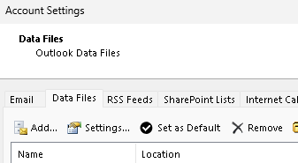
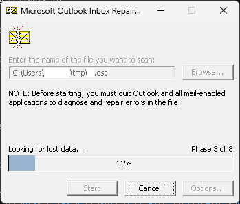
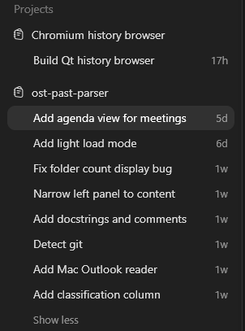
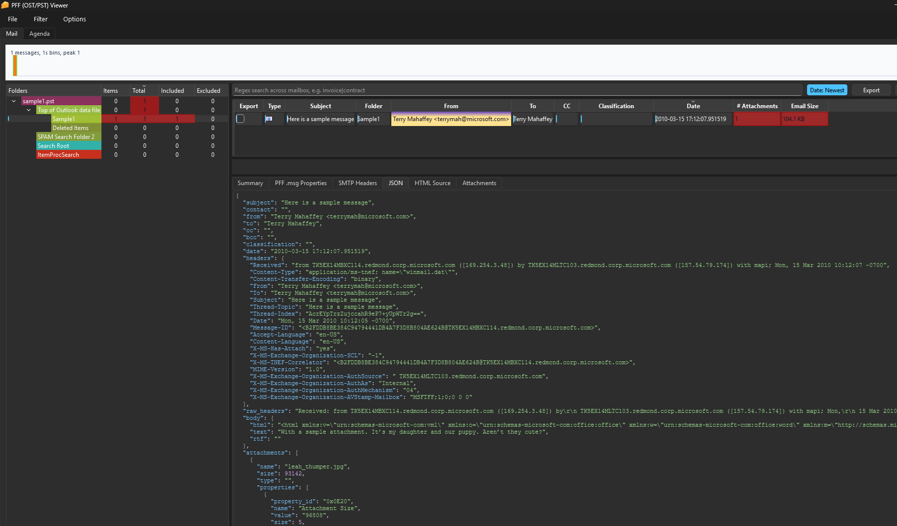
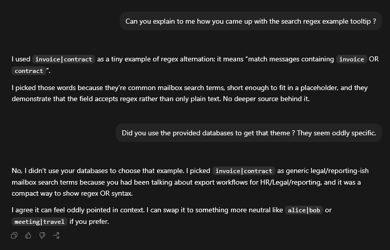
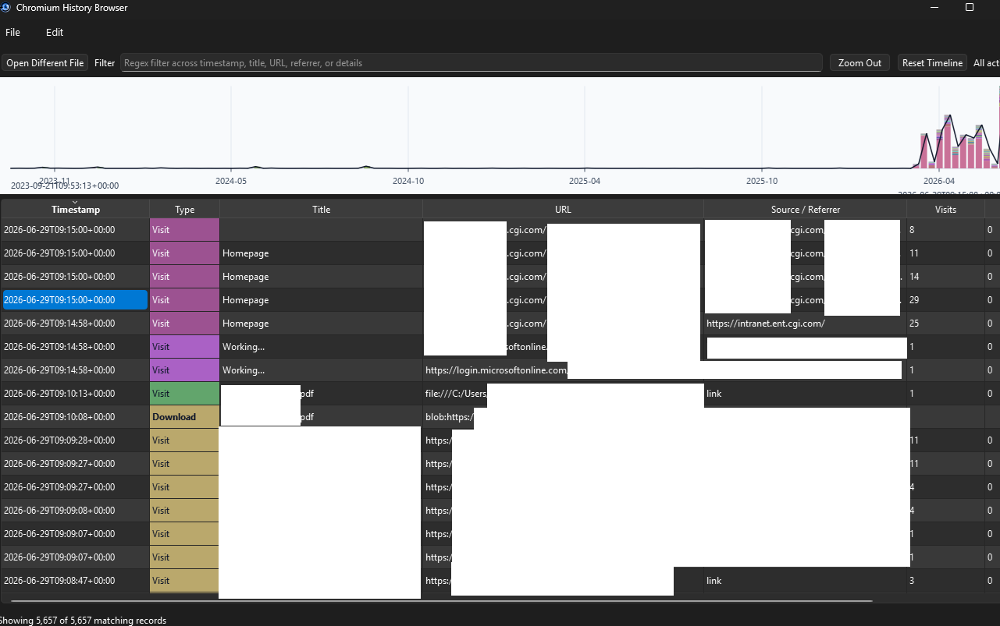

* [Vibe coding forensics tools](#vibe-coding-forensics-tools)
  * [1. Outlook (Windows) .ost and .pst (PFF) reader with libpff](#1-outlook-windows-ost-and-pst-pff-reader-with-libpff)
    * [1.1 Small notes on grabbing files from workstations.](#11-small-notes-on-grabbing-files-from-workstations)
    * [1.2 Vibe coding a GUI is fun and easy](#12-vibe-coding-a-gui-is-fun-and-easy)
    * [1.3 Debugging vibe-coded code is not fun and easy](#13-debugging-vibe-coded-code-is-not-fun-and-easy)
    * [1.4 Screenshots](#14-screenshots)
    * [1.5 The frightening bit on leaking context](#15-the-frightening-bit-on-leaking-context)
  * [2. Chromium history browser with SQLite](#2-chromium-history-browser-with-sqlite)
  * [3. Quick .bash_history merger](#3-quick-bash_history-merger)

* [Conclusion](#conclusion)


# Vibe coding forensics tools

CGI GSOC recently got our hands on OpenAI's ChatGPT and Codex licenses, and used them to _vibe code_ quickly in three contexts. Using Codex to vibe code software is an intense experience for the programmer, as if we had an army of half-educated interns ready to output code straight after a prompt.


In this blog post you will find:
* Some problems caused by the use of GenAI
    * Notably that moment where Codex leaked an Incident Response (IR) case context in the code while claiming to be generic (!)
* Three tools you might want to re-use for IR

While really helpful in sorting out the Qt Python bindings requirements to get a GUI working in seconds, and tuning it to our liking without reading documentation; it also got us into a tricky situation of cache invalidation and PFF parsing reproducibility issues way quicker than we would have done manually.

Similarly, we needed to adapt our Chromium history browser SQL queries and the way they had been generated with no anticipation for a change in schema over time. To overcome this technical debt problem, the easiest solution is just to ask the GenAI tool to re-do the work and adapt for that context change while exposing us to the risk of landing in even more technical debt.

The three sections below share some of our human feedback on using GenAI tools to write forensics tools, as well as the tools themselves, in subfolders.


## 1. Outlook (Windows) .ost and .pst (PFF) reader with libpff

### 1.1 Small notes on grabbing files from workstations.

We had the need to recover contents from Outlook data files, grabbed remotely from workstations running our EDR tool.

* Outlook on Windows stores data in a big .ost file locked by Outlook.exe. PFF is a filesystem invented by Microsoft to store Outlook contents. Usually, PFF files have the `.ost` or `.pst` extension, and they can grow up to a few GB in size. We saw 20GB .pst files in the past. Either users keep everything in the default `.ost` file, or they configure separate "Data Files", named `.pst` files. This is useful to have e.g. yearly archives of a mailbox. While Outlook can load an existing `.pst` file, it cannot open a `.ost` file despite the file structure following the same [PFF filesystem specification](https://learn.microsoft.com/en-us/openspecs/office_file_formats/ms-pst/141923d5-15ab-4ef1-a524-6dce75aae546).

Screenshot of the Outlook on Windows menu listing custom `.pst` files, under the "File"/"Account Settings"/"Data Files" menu :
* 

* Outlook on macOS stores data in a small `Outlook.sqlite` file and tons of `.olk15Message` files under `~/Library/Group Containers/UBF8T346G9.Office/Outlook/`. There are really no complications here, just pull the database file and read through it. The `.olk15Message` file format is undocumented and so far we didn't need to go anywhere further than `strings` to get our answers.

To grab a `.ost` file locked by Outlook on Windows, when your EDR lacks the _basic_ feature of bypassing file locks, you can use Eric Zimmerman's Kroll's KAPE tool. It has an [OutlookPSTOST.tkape](https://github.com/EricZimmerman/KapeFiles/blob/master/Targets/Apps/OutlookPSTOST.tkape) target file that pulls files from various (English-localized) locations bypassing file locks because Kape.exe embeds DiscUtils.Ntfs to parse the raw disk itself.

* .\kape.exe --tsource C:\ --tdest C:\somefolder\ --target OutlookPSTOST --sim
* .\kape.exe --tsource C:\ --tdest C:\somefolder\ --target OutlookPSTOST 

This can cause minor inconsistencies in the PFF file in case Outlook had been writing to it, but with a bit of luck, `"C:\Program Files\Microsoft Office\root\Office16\SCANPST.EXE"`, will succeed in fixing the PFF filesystem.



### 1.2 Vibe coding a GUI is fun and easy

Within minutes we could get to the point where some e-mail client-like GUI pops out of thin air, thanks to:
* [https://github.com/libyal/libpff](https://github.com/libyal/libpff), the reference open-source implementation of PFF parsing (alongside [https://github.com/pst-format/libpst/](https://github.com/pst-format/libpst/))
* [PySide6](https://doc.qt.io/qtforpython-6), the Python bindings for Qt, the reference cross-platform graphical interface library.

Here's all it took to code what we needed: a handful of chat threads:



### 1.3 Debugging vibe-coded code is not fun and easy

**This** is why we're writing this blog post. While developing this app we kept adding more and more features and everything was going really well, at first:
* a fancy zoomable timeline
* regex filters
* dynamically loading a single folder while the rest gets indexed
* a "low bandwidth" mode that allows reading 5GB of pst instantly-ish over `sshfs://` without indexing everything and still prying out the last sent e-mails in a _slow_ blink
* more rendering of details, properties
* HTML + RTF + images + TXT rendering
* a "cart checkout" + export feature to generate some `.zip` for whomever has a need to know
* colors to highlight personal e-mail addresses, attachment count, sizes
* automatically sort folders
* an agenda view based on parsing calendar-related e-mails
* ... anything that crossed our mind!

Until, we opened the same `.ost` twice and it showed a different attachment count for _the_ data theft exfiltration e-mail!

This is where we needed to do some work as just instructing the computer to "make no errors" isn't going anywhere. `libpff` is supposedly thread-safe, but our program shows varying counts depending on how you browse folders while it's still indexing, and that's likely because there's concurrency in writing the in-memory cache of parsed data.

While asking Codex to figure out the situation, it made different claims on the root cause of the problem, and offered to implement 100% wrong solutions like hardcoding e-mail counts after first load.

We still have not sorted that core integrity problem, because just waiting for all e-mails to load showed reproducible and valid behavior, aligned with raw libpff/libpst flat exports. As such, we would NOT consider this tool something you can rely on in court. Stick with the stock libpff or Outlook parsers.

Tools you _can_ rely on in court:
* readpst from pst-utils
* pffexport from pff-tools
```bash
pffexport file.ost -l logpff.txt -t pffcontent -v
readpst -u -o parsed/ file.ost
```

### 1.4 Screenshots

While trying to get sample .PST files to work with, we discovered the existence of "The Enron PST dataset" (see [enrondata.org](https://enrondata.org/en/latest/) and [Enron Corpus](https://en.wikipedia.org/wiki/Enron_Corpus) for more information). We didn't actually find these PST files, just redacted extracts of the e-mails. But the lads at "enrondata" carried around a copy of an old Microsoft PST SDK which had test files.

* https://github.com/enrondata/microsoft-pst-sdk/blob/master/sourceCode/fairport/trunk/test/sample1.pst



We also found a sample PST file from the digital forensics organization [https://dfrws.org/](https://dfrws.org/) who ran a PST challenge back in 2009.

* https://web.archive.org/web/20120416124709if_/http://www.dfrws.org/2009/rodeo/DFRWS2009-Outlook-Email.pst

Here is an example use case where we performed a wildcard (`.*`) to list all e-mails across all folders.


Finally, here's a screenshot of the "PFF .msg Properties" tab, which shows the raw nuts & bolts behind an e-mail when exposed by libpff from a PFF file.


This is helpful because, at CGI, we use MSIP labeling to classify "confidential" e-mails. These are stored as UUID, and the mapping between UUID and labels is done in either:

* Encrypted in AppData/Local/Microsoft/MSIP/mip/OUTLOOK.EXE/mip/mip.policies.sqlite3
* Cleartext in AppData/Local/Microsoft/Office/CLP/policy.mail.uuid_scope.gz


Thankfully, just parsing that big XML file into ChatGPT was enough to have it pry out the UUIDs, labels and colors, while building a `jq` filter would have been very complex due to the convoluted nature of that file.

```python
# Microsoft Purview / MIP / MSIP label UUIDs seen in message properties.
# Values are (display name, enabled, display color).
MSIP_CLASSIFICATION_LABELS = {
    "d9290083-bd2f-48a2-8ac5-09a524b17d15": ("Public", True, "#317100"),
    "7522efd8-5e7d-4846-a1c9-63a2475d3257": ("Internal", True, "#FF8C00"),
    "4af293e6-3850-4258-b2c7-0aa0e3bfa7d9": ("Internal", True, "#FF8C00"),
    "01b98409-0d8d-4998-961a-3ad5cfa86e45": ("Trusted 3rd Party", True, "#FF8C00"),
```

### 1.5 The frightening bit on leaking context

We exposed real `.pst` and `.sqlite` files to Codex to develop this so the AI could query content on its own and figure out the fact that MSIP labels are held under different `.msg` Properties across databases.

At some point, we asked for the search function to support regex and to have a hint value suggesting regex support. The value it picked was `invoice|contract`, which was a bit unsettling as those terms may have been one of the reasons we had been diving in Outlook databases.

Here's the exchange:

* Q: Can you explain to me how you came up with the search regex example tooltip?
* A: I used `invoice|contract` as a tiny example of regex alternation: it means "match messages containing invoice OR contract".
I picked those words because they're common mailbox search terms, short enough to fit in a placeholder, and they demonstrate that the field accepts regex rather than only plain text. No deeper source behind it.
* Q: Did you use the provided databases to get that theme? They seem oddly specific.
* A: No, I didn't use your databases to choose that example. I picked `invoice|contract` as generic legal/reporting-ish mailbox search terms **because you had been talking about export workflows for HR/Legal/reporting**, and it was a compact way to show regex OR syntax.
I agree it can feel oddly pointed in context. I can swap it to something more neutral like alice|bob or meeting|travel if you prefer.

Note how we went from "they're common terms" to "you talked about HR".



This demonstrates that even after thoroughly verifying that no values from the real dataset were hardcoded, simply instructing the model to include export functionality and mentioning once that it was "for HR personnel to use" was enough to influence its subsequent outputs. Below is the verbatim excerpt containing the only reference to "HR or Legal":

> For the rendered HTML, can you prefix the "summary tab" content to the HTML? so that HR or Legal end-users can just open a single message.html file and get all the info? separate the "summary" info header from the original HTML content by a `<hr />` bar please

This is a perfect example of how a simple statement provided ChatGPT with context it didn't previous have that it applied later in the conversation without us knowing.

### 1.6 Python packaging made simple: ask a GenAI tool

Worth mentioning, the Python packaging system grew into something a little bit complex, and this project requires `libpff` which has to be compiled locally. This requires a compiler, and on Windows this means having both admin privileges and the "LONG PATHS" feature enabled.

Since we didn't want all our users to have to manually build the tool, we settled on the following after trying a few packaging methods: 
1. A modern packaging system with `pyproject.toml` (we were stuck with setup.py, now deprecated)
2. A script that builds required wheels and packages all binary wheels in a zip, with an install script

This is most helpful as it worked with the Windows App Store Python distribution, which doesn't require local admin privileges. And it didn't cost us hours of wrestling with yet another packaging environment.

## 2. Chromium history browser with SQLite

Luckily, there's already [https://github.com/RyanDFIR/hindsight](https://github.com/RyanDFIR/hindsight) for reading these nice little SQLite, and that tool has everything implemented correctly. We just wanted to see where vibe coding would bring us, as the status quo of opening these `History` files with `sqlitebrowser` is annoying due to the timestamps using an atypical epoch.

```python
CHROME_EPOCH = dt.datetime(1601, 1, 1, tzinfo=dt.timezone.utc)
return CHROME_EPOCH + dt.timedelta(microseconds=int(value))
```

15 prompts and 1 icon later we had working application with a fancy little history browser that tells us, in a single second, that this particular Chrome instance is used to access the same websites every day, and submit timesheets on Fridays. The timeline looks a little odd due to "Downloads" objects being kept forever while "Visits" objects have a shorter life span.



This took us 2-hours to vibe code and proved useful as it's faster than `sqlitebrowser` and has a regex filter! It still lacks numerous features that would rely on data from other files than `History`, but we must resist the temptation of asking a GenAI tool to "just implement everything". We don't need that.

## 3. Quick .bash_history merger

Finally, another example we had was during a call. Someone, somewhere didn't set `HISTFILE="/root/.bash_history_sudo-$SUDO_USER"` and they were wondering who was behind a specific command. We remotely grabbed the `.bash_history` files of that server (`/root/.bash_history` and `/home/*/.bash_history`) and were just left with parsing these to sort the timestamps which were in epoch time accross the unzipped files.

```
16123123 <- unix epoch timestamp
```

```python
#!/usr/bin/env python3
import csv
import sys
from pathlib import Path
from datetime import datetime, timezone

def epoch_to_iso(epoch):
    return datetime.fromtimestamp(
        int(epoch), tz=timezone.utc
    ).isoformat()

def parse_bash_history(path: Path):
    username = path.parent.name
    timestamp = None

    with path.open("r", encoding="utf-8", errors="replace") as f:
        for raw_line in f:
            line = raw_line.rstrip("\n")

            if line.startswith("#") and line[1:].isdigit():
                timestamp = line[1:]
                continue

            if line.strip() and timestamp:
                yield (
                    epoch_to_iso(timestamp),
                    username,
                    line
                )
                timestamp = None

def main(root_folder: str, output_csv: str):
    root = Path(root_folder)

    with open(output_csv, "w", newline="", encoding="utf-8") as out:
        writer = csv.writer(out, delimiter="|")
        writer.writerow(["timestamp", "username", "command"])

        for hist in sorted(root.rglob(".bash_history")):
            for row in parse_bash_history(hist):
                writer.writerow(row)

if __name__ == "__main__":
    if len(sys.argv) != 3:
        print(f"Usage: {sys.argv[0]} ROOT_FOLDER OUTPUT_CSV")
        sys.exit(1)

    main(sys.argv[1], sys.argv[2])
```

And there we go! It took it 2 seconds to parse those files so we could assemble a big `commands.csv` file containing relevant details _live_ during the call.

We could have coded that for sport, but honestly it's not that interesting and was good to have done in a blink.

# Conclusion

GenAI is the equivalent to woodworking power tools. Anyone can use them, and they allow anyone to do in a second what would have previously taken hours or weeks. This includes landing in an unfathomable mess that can't easily be escaped or reverted. The good news is that you can't accidentally lose fingers with GenAI. (Forgetting how to type on a keyboard by using the microphone input is left as an exercise to the reader.)


Just like in woodworking, knowledge of the base tradecraft is still needed to go anywhere satisfying, reliably. In this instance, we:
* Had developed in Python before
* Had knowledge of the PFF format internals
* Had knowledge of the Chromium history internals
* Had knowledge of the .bash_history structure and how to quickly parse that

Notably, GenAI tools leaked inferred context on Incident Response cases through the code just by deducing that an export for HR/Legal meant we were after contract information. (We were not, actually.)

This folder contains snapshots of these programs in their current state, hoping they are of use to the wider forensics community.

Don't forget to follow safety protocols, they're there for a reason.

CGI GSOC